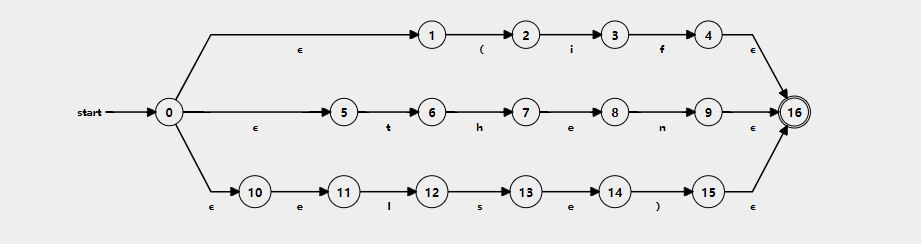
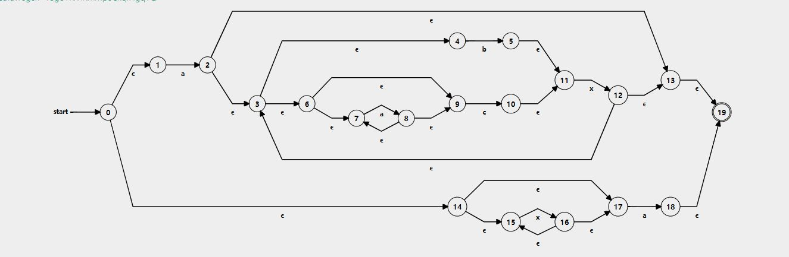
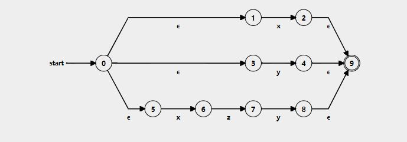
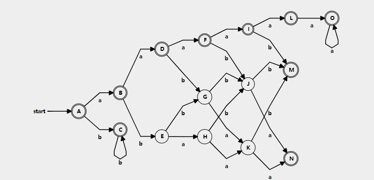
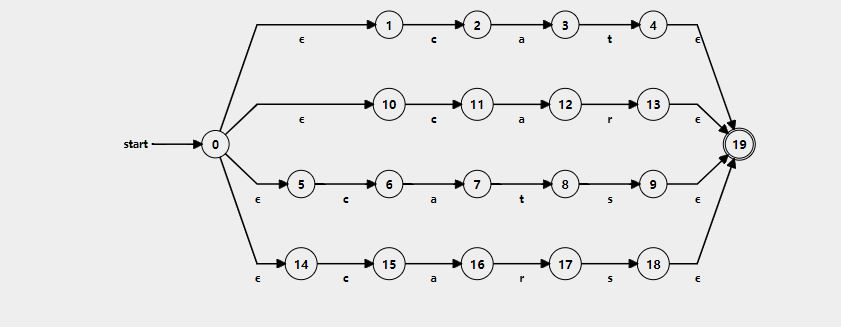

- 2.1
  
a. $c*a(a|c)*b[a-c]*$, tips: *~a~b~* 包含所有第一个a在第一个b前的情况

b. $(b|c)* (a(b|c)*a(b|c)*)*$, tips: 需要符合 *(~)(a~a~)(a~a~)(a~a~)…*

c. $(1|0)*00$

d. $10101(0|1)|1011(0|1)(0|1)|11(0|1)(0|1)(0|1)(0|1)|(0|1)*1 (0|1)*(0|1)(0|1)(0|1)(0|1)(0|1)(0|1)$ 

e. $(a|c)*(b|bc(a|c)*|ba|bac(a|c)*)*$, tips: 分为不包含b，包含b(~bac~,~bab~, ~bb~)

f. $(00|0[1-7][0-7]*)|( 0|[1-9][0-9]*)$

g. $1|10$, tips: n不大于2

- 2.2

a. 无法统计个数

b. 正则无法表示逆序

c. 正则无法表示嵌套

- 2.3

a. 除了0110外的二进制数

b. 符合a aaaaa aaaaaaaaaa....(a个数为等差数列)

c. 1开头的二进制回文串，前后有n个0

- 2.4
  
a. 

b. 

- 2.5

a. 

b. 

c. 

- 2.6
  
可以合并{1,5} {2,8} {4,6}
